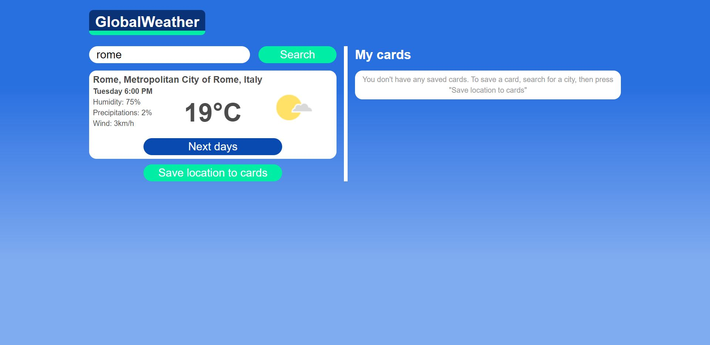
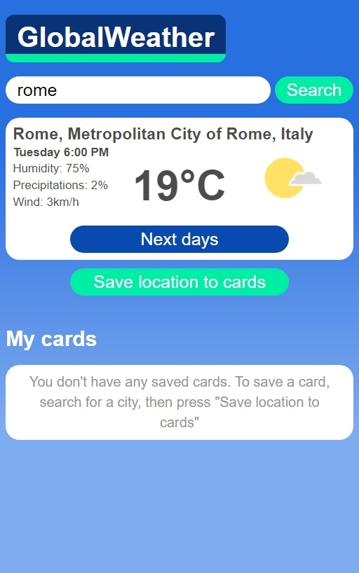
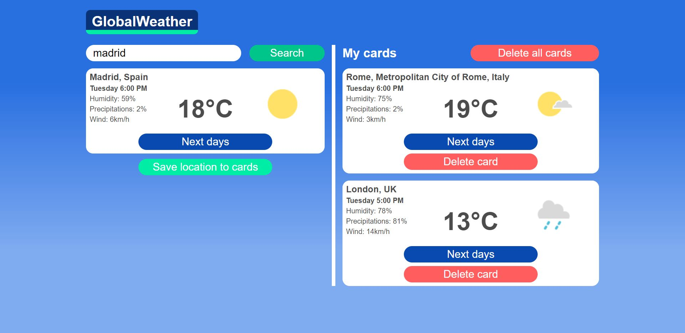
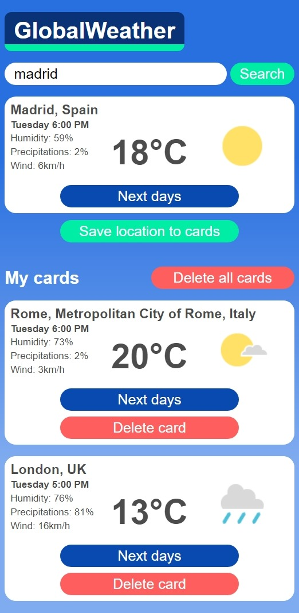
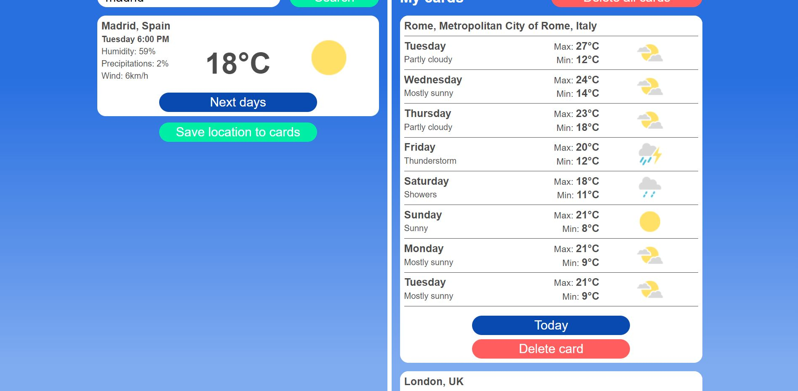
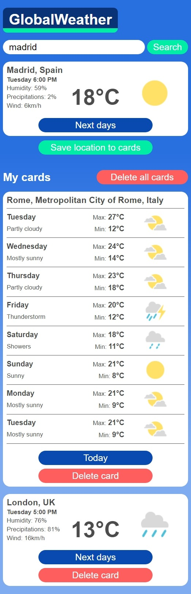

# globalweather
Weather app where the user can search for locations and also save them for faster viewing next time

*API available at: https://weatherdbi.herokuapp.com/

img1 and img2 show the default page when the user accesses the app. The location is automatically detected if the user has the location enabled, otherwise the app will display a message to manually search for a location

img3 and img4 show what the app looks like if the user has saved some locations (in the "My cards" section) and also has a searched location on display

img5 and img6 show the interface of the app when a card displays the forecast for the next days

